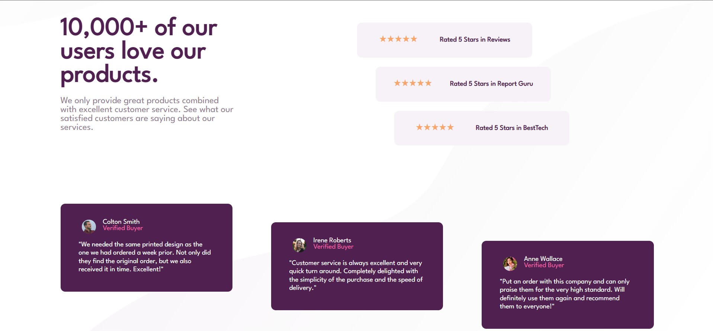

# Frontend Mentor - Social proof section solution

This is a solution to the [Social proof section challenge on Frontend Mentor](https://www.frontendmentor.io/challenges/social-proof-section-6e0qTv_bA).

## Table of contents

- [Overview](#overview)
  - [The challenge](#the-challenge)
  - [Screenshot](#screenshot)
  - [Links](#links)
- [My process](#my-process)
  - [Built with](#built-with)
  - [What I learned](#what-i-learned)
  - [Useful resources](#useful-resources)
- [Author](#author)


## Overview

### The challenge

Users should be able to:

- View the optimal layout for the section depending on their device's screen size

### Screenshot




### Links

- Live Site URL: [Social proof section](https://pratyush-dehury.github.io/Social-proof-section/)

## My process

### Built with

- Semantic HTML5 markup
- CSS custom properties
- Flexbox
- Mobile-first workflow


### What I learned

- CSS Positioning

  ``` css
    #text,
    .rating,
    .comment {
        position: absolute;
      }
  ```
- CSS Flexbox

### Useful resources

- [A Complete Guide to Flexbox | CSS-Tricks](https://css-tricks.com/snippets/css/a-guide-to-flexbox/) - This helped me for applying css flexbox layout.


## Author

- [Pratyush Dehury](https://www.your-site.com)
- Frontend Mentor - [@pratyushd0308](https://www.frontendmentor.io/profile/pratyushd0308)
